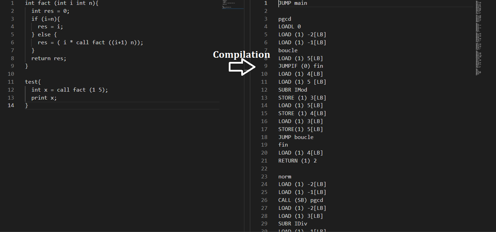

# Le compilateur:
les fonction `compiler` et `compilerVersFichier` dans le script compilateur.ml servent à compiler un fichier .rat en assembleur .tam 

# Exemple de compilation:
 fichiersRat/testFonctionRec.rat -> fichiersRat/testFonctionRec.tam 
 